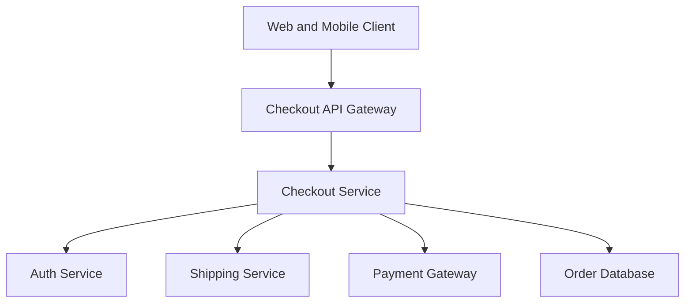
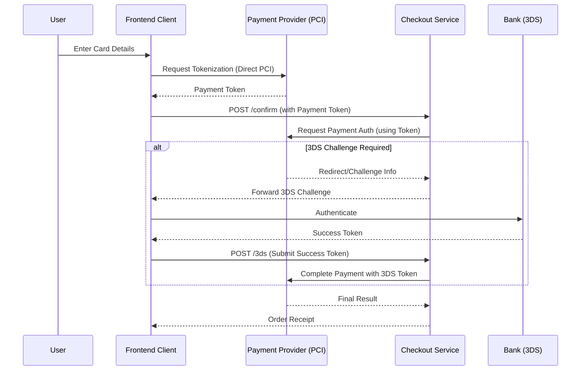

# Design Document - Checkout Feature

## Overview
The Checkout feature enables users to purchase items from their cart. It supports two distinct paths: a streamlined Guest Checkout and a data-driven Registered User Checkout.

### Goals
- Provide a seamless transition from cart to order completion.
- Support guest users without mandatory account creation.
- Leverage saved user data for authenticated customers to speed up the process.
- Ensure secure and validated payment processing.

### Non-Goals
- Inventory management (handled by Inventory Service).
- Post-purchase order tracking (handled by Order Management System).
- Marketing email subscriptions (handled by CRM integration).

## Architecture

### Architecture Pattern & Boundary Map
The checkout process follows a **State Machine** pattern to manage the various stages (Auth -> Shipping -> Payment -> Summary).




### Technology Stack

| Layer    | Choice / Version  | Role in Feature                     |
| -------- | ----------------- | ----------------------------------- |
| Frontend | React 18+         | User Interface and State Management |
| Backend  | Node.js (Express) | API and Business Logic              |
| Data     | PostgreSQL        | Order and Transaction Persistence   |
| Auth     | JWT / OAuth2      | User Identification                 |

### Payment Flow with Tokenization and 3D Secure


## Requirements Traceability

| Requirement | Summary       | Components         | Interfaces       | Flows         |
| ----------- | ------------- | ------------------ | ---------------- | ------------- |
| 1.1         | Auth Choice   | CheckoutController | ICheckoutService | Auth Flow     |
| 1.2         | Bypass Auth   | CheckoutController | IAuthService     | Auth Flow     |
| 2.1         | Guest Data    | CheckoutService    | ICheckoutService | Shipping Flow |
| 3.1         | Saved Data    | CheckoutService    | IUserService     | Shipping Flow |
| 4.1         | Order Summary | SummaryComponent   | IOrderService    | Summary Flow  |
| 5.1         | 3DS Challenge | PaymentComponent   | IPaymentGateway  | 3DS Flow      |

## Components and Interfaces

### Backend Service Layer

#### CheckoutService

| Field        | Detail                                                      |
| ------------ | ----------------------------------------------------------- |
| Intent       | Orchestrates the checkout stages and validates transitions. |
| Requirements | 1.1, 1.2, 2.1, 3.1, 4.1                                     |

**Dependencies**
- Outbound: AuthService — Verify user status (P0)
- Outbound: ShippingService — Calculate costs (P1)
- Outbound: PaymentGateway — Process transaction (P0)

**Contracts**: Service [x] / API [x] / State [x]

##### Service Interface
```typescript
interface CheckoutService {
  // Re-validates cart prices and inventory upon start
  startCheckout(cartId: string): Promise<CheckoutSession>;
  setShippingInfo(sessionId: string, info: ShippingDetails): Promise<CheckoutSession>;
  // Uses paymentMethodToken (PCI compliance)
  processPayment(sessionId: string, paymentToken: string): Promise<OrderResult | TDSRedirect>;
  finalize3DS(sessionId: string, tdsToken: string): Promise<OrderResult>;
}
```

##### API Contract
| Method | Endpoint                   | Request         | Response        | Errors   |
| ------ | -------------------------- | --------------- | --------------- | -------- |
| POST   | /api/checkout/start        | { cartId }      | CheckoutSession | 400, 404 |
| PUT    | /api/checkout/:id/shipping | ShippingDetails | UpdatedSession  | 400, 422 |
| POST   | /api/checkout/:id/confirm  | { paymentToken }| OrderReceipt or { challengeUrl } | 402, 500 |
| POST   | /api/checkout/:id/3ds      | { tdsToken }    | OrderReceipt    | 402, 500 |

## Data Models

### Domain Model
- **CheckoutSession**: Transient state of the current checkout process.
- **GuestProfile**: Temporary user data for the duration of the order.
- **Order**: The final immutable record of the purchase.

### Logical Data Model
- `Order` belongs to `User` (optional for guests).
- `Order` has many `OrderItems`.
- `CheckoutSession` references `Cart`.

## Error Handling

### Error Strategy
- **Validation Errors**: Return 422 with field-specific messages.
- **Payment Failures**: Return 402 with actionable reasons (e.g., "Insufficient funds").
- **Session Timeout**: Invalidate checkout state after 30 minutes of inactivity.

## Testing Strategy
- **Unit Tests**: Test `CheckoutService` transition logic and state validation.
- **Integration Tests**: Verify end-to-end flow from `startCheckout` to `processPayment` with a mock Payment Gateway.
- **UI Tests**: Test the authentication toggle (Login vs Guest) on the frontend.

## Security Considerations

### 1. Payment Security (PCI DSS)
The system uses a tokenization approach. Card data is sent directly from the client to the payment provider. The `CheckoutService` only handles ephemeral payment tokens, ensuring no sensitive cardholder data is stored or processed on the server.

### 2. Data Integrity
- **Price Re-validation**: The `CheckoutService.startCheckout` method MUST fetch current product prices and stock from the master database/service, ignoring any values provided by the client's cart state to prevent price manipulation.
- **Session Binding**: `CheckoutSession` IDs must be non-predictable (UUID v4) and bound to the authenticated user ID or a secure browser session token.

### 3. Fraud Prevention
- **Rate Limiting**: Apply rate limiting on `/confirm` and `/shipping` endpoints to prevent brute-force enumeration of valid email addresses or brute-force payment attempts.
- **Idempotency**: All payment confirmation and 3DS completion requests must use an idempotency key to prevent double charging on retry scenarios.
