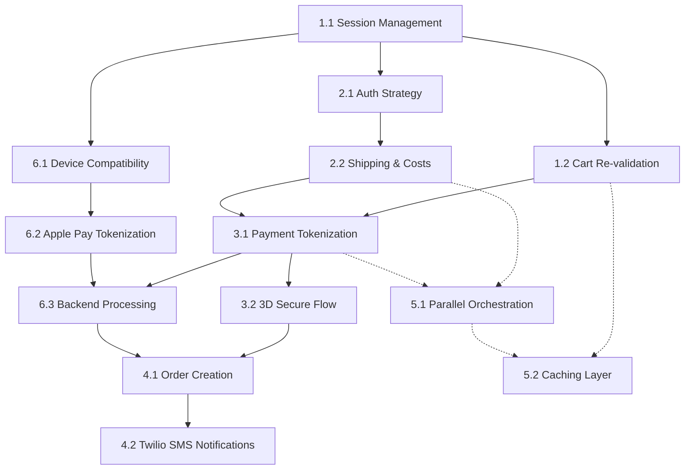

# Implementation Tasks - Checkout Feature

## Implementation Roadmap (Dependency Graph)

## 1. Checkout Session and Base Infrastructure
- [x] 1.1 (P) Implement Checkout Session Management
- [x] 1.2 (P) Develop Server-side Cart Re-validation

## 2. Authentication Flow and Shipping Information
- [x] 2.1 (P) Implement Authentication Strategy for Checkout
- [x] 2.2 (P) Build Shipping Information and Cost Calculation

## 3. Payment Processing and 3D Secure Integration
- [x] 3.1 Implement Secure Payment Tokenization Flow
- [x] 3.2 Build 3D Secure Challenge and Finalization

## 4. Order Completion and Async Notifications
- [x] 4.1 Implement Order Creation and Checkout Finalization
- [x] 4.2 (P) Integrate Twilio SMS Notifications

## 5. Performance and Resilience Optimizations
- [x] 5.1 (P) Implement Parallel Service Orchestration
- [x] 5.2* (P) Add Performance Caching Layer

## 6. Apple Pay Integration
- [ ] 6.1 (P) Implement Apple Pay Device Compatibility Check
  - Develop the logic to detect if the user's device and browser support Apple Pay.
  - Ensure the Apple Pay button is only rendered when `window.ApplePaySession` is available and active.
  - _Requirements: 7.1_

- [ ] 6.2 (P) Build Apple Pay Frontend Sheet and Tokenization
  - Integrate with the Apple Pay JS API to launch the payment sheet with order totals.
  - Implement the callback to receive and format the Apple Pay payment token securely.
  - Handle user cancellations and sheet timeouts gracefully.
  - _Requirements: 7.2, 7.3_

- [ ] 6.3 Implement Backend Apple Pay Token Processing
  - Update the checkout confirmation logic to accept and validate the Apple Pay provider and token.
  - Integrate the Apple Pay token with the existing Payment Gateway authorization flow.
  - _Requirements: 7.3, 7.4_
